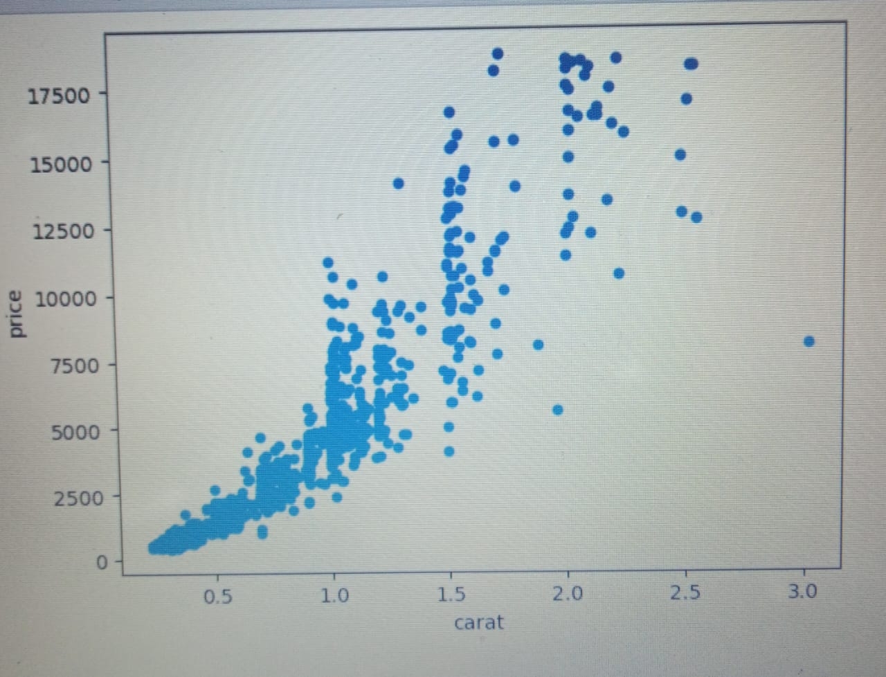

# multiple-regression-cumulative-lab
# Multiple Linear Regression - Diamond Price Analysis

## Overview
This project demonstrates an end-to-end multiple linear regression analysis on a diamonds dataset. The goal is to determine which features influence diamond prices and quantify their effects using regression models.

---

## Objectives
- Prepare data for regression analysis using `pandas`.
- Build both baseline and iterated multiple linear regression models using `statsmodels`.
- Evaluate model performance using metrics such as R-squared and F-statistic.
- Interpret coefficients of numeric and categorical predictors.

---

## Dataset
The dataset contains 53,940 diamonds with features such as:

| Feature   | Description |
|-----------|-------------|
| `price`   | Price in USD |
| `carat`   | Weight of the diamond |
| `cut`     | Quality of cut (Fair, Good, Very Good, Premium, Ideal) |
| `color`   | Diamond color (J worst → D best) |
| `clarity` | Clarity measurement (I1 worst → IF best) |
| `x`       | Length in mm |
| `y`       | Width in mm |
| `z`       | Depth in mm |
| `depth`   | Depth percentage = 2 * z / (x + y) |
| `table`   | Width of top relative to widest point |

---

## Methodology

### 1. Loading Data Using Pandas
Categorical variables were one-hot encoded for regression:

```python
import pandas as pd
diamonds = pd.read_csv("diamonds.csv", index_col=0)
diamonds.head()
```
### 2. Building a Baseline Simple Linear Regression Model
#### Identifying a Highly Correlated Predictor

# Step 2.1: Identify a Highly Correlated Predictor

```python
numeric_cols = ['carat', 'depth', 'table', 'x', 'y', 'z', 'price']
# Compute correlation matrix
corr = diamonds[numeric_cols].corr()
# Display correlations sorted by strength with price
corr['price'].sort_values(ascending=False)
```
output 
```text
price    1.000000
carat    0.921591
x        0.884435
y        0.865421
z        0.861249
table    0.127134
depth   -0.010647
Name: price, dtype: float64
```
### Plotting the Predictor vs. Price


### Setting Up Variables for Regression¶
```python
y = diamonds['price']
X_baseline = diamonds[['carat']]
```
### Creating ,Fitting  and Evaluating Simple Linear Regression
```python
import statsmodels.api as sm

baseline_model = sm.OLS(y, sm.add_constant(X_baseline))
baseline_results = baseline_model.fit()
```

```python
# Display model summary to see coefficients, R-squared, and other stats
print(baseline_results.summary())

# Extract and print key evaluation metrics
print("\nModel Evaluation Metrics:")
print(f"R-squared: {baseline_results.rsquared:.4f}")
print(f"Adjusted R-squared: {baseline_results.rsquared_adj:.4f}")
print(f"Intercept: {baseline_results.params['const']:.2f}")
print(f"Coefficient for carat: {baseline_results.params['carat']:.2f}")
```

### output
```text
                           OLS Regression Results                            
==============================================================================
Dep. Variable:                  price   R-squared:                       0.849
Model:                            OLS   Adj. R-squared:                  0.849
Method:                 Least Squares   F-statistic:                 3.041e+05
Date:                Sat, 04 Oct 2025   Prob (F-statistic):               0.00
Time:                        11:07:47   Log-Likelihood:            -4.7273e+05
No. Observations:               53940   AIC:                         9.455e+05
Df Residuals:                   53938   BIC:                         9.455e+05
Df Model:                           1                                         
Covariance Type:            nonrobust                                         
==============================================================================
                 coef    std err          t      P>|t|      [0.025      0.975]
------------------------------------------------------------------------------
const      -2256.3606     13.055   -172.830      0.000   -2281.949   -2230.772
carat       7756.4256     14.067    551.408      0.000    7728.855    7783.996
==============================================================================
Omnibus:                    14025.341   Durbin-Watson:                   0.986
Prob(Omnibus):                  0.000   Jarque-Bera (JB):           153030.525
Skew:                           0.939   Prob(JB):                         0.00
Kurtosis:                      11.035   Cond. No.                         3.65
==============================================================================

Notes:
[1] Standard Errors assume that the covariance matrix of the errors is correctly specified.

Model Evaluation Metrics:
R-squared: 0.8493
Adjusted R-squared: 0.8493
Intercept: -2256.36
Coefficient for carat: 7756.43
```
### Summary of the findings 
## Baseline Model: Diamond Price vs. Carat

The simple linear regression model examines the relationship between **diamond price** (dependent variable) and **carat weight** (independent variable).

### Model Fit and Performance
- **R-squared:** 0.8493  
  Approximately 84.9% of the variation in diamond prices is explained by carat weight alone, indicating a strong linear relationship.
- **Adjusted R-squared:** 0.8493  
  Confirms the model fits well even after adjusting for the single predictor.
- **F-statistic:** 3.04e+05 (p < 0.001)  
  The model is statistically significant; carat weight is a significant predictor of diamond price.

### Model Coefficients
- **Intercept (const):** -2256.36  
  The theoretical baseline price of a diamond with zero carats (used for model calculation; not practical in reality).
- **Carat coefficient:** 7756.43  
  For each additional carat, the diamond price increases by ~Ksh 7,756.43 on average.

### Regression Equation
The baseline regression model can be expressed as:

```text
Price = -2256.36 + 7756.43 *Carat
```

### Conclusion
The baseline model demonstrates a **strong positive and statistically significant relationship** between diamond carat weight and price.

## Setting Up Variables for Regression
```python
X_iterated = diamonds[[most_correlated, cat_col]]
X_iterated
```
### Preprocessing Categorical Variable¶
```python
X_iterated = pd.get_dummies(X_iterated, columns=[cat_col])
X_iterated
```
changing the boolean values for the four "cut" column to 1s and 0s in order for the regression to run.
```python
X_iterated = X_iterated.astype(int)
```
## Building  a Multiple Linear Regression Model
Using the y variable from our previous model and X_iterated, build a model called iterated_model and a regression results object called iterated_results
```python
import statsmodels.api as sm
X_iterated = sm.add_constant(X_iterated)
iterated_model = sm.OLS(y, X_iterated)
iterated_results = iterated_model.fit()
# Display the summary
iterated_results.summary()
```
### Output 
```text
OLS Regression Results                            
==============================================================================
Dep. Variable:                  price   R-squared:                       0.747
Model:                            OLS   Adj. R-squared:                  0.747
Method:                 Least Squares   F-statistic:                 1.991e+04
Date:                Sat, 04 Oct 2025   Prob (F-statistic):               0.00
Time:                        11:26:58   Log-Likelihood:            -4.8670e+05
No. Observations:               53940   AIC:                         9.734e+05
Df Residuals:                   53931   BIC:                         9.735e+05
Df Model:                           8                                         
Covariance Type:            nonrobust                                         
================================================================================
                   coef    std err          t      P>|t|      [0.025      0.975]
--------------------------------------------------------------------------------
const         1960.7860     47.484     41.293      0.000    1867.717    2053.855
carat         6272.3064     16.010    391.775      0.000    6240.927    6303.686
clarity_I1   -3707.9335     88.495    -41.900      0.000   -3881.384   -3534.483
clarity_SI1   -643.1773     50.775    -12.667      0.000    -742.697    -543.657
clarity_SI2  -1268.7240     52.590    -24.125      0.000   -1371.800   -1165.648
clarity_VS1    -43.4767     52.431     -0.829      0.407    -146.241      59.288
clarity_VS2   -245.7894     50.882     -4.831      0.000    -345.519    -146.059
clarity_VVS1  -192.7507     57.890     -3.330      0.001    -306.215     -79.287
clarity_VVS2   -19.1690     55.186     -0.347      0.728    -127.334      88.996
==============================================================================
Omnibus:                    11476.064   Durbin-Watson:                   0.784
Prob(Omnibus):                  0.000   Jarque-Bera (JB):            29801.289
Skew:                           1.158   Prob(JB):                         0.00
Kurtosis:                       5.810   Cond. No.                         19.0
==============================================================================

Notes:
[1] Standard Errors assume that the covariance matrix of the errors is correctly specified.
```
## Summary of Findings

## Iterated Model: Diamond Price vs. Carat and Clarity

The iterated multiple linear regression model examines **diamond price** using **carat weight** and **clarity** as predictors.

### Overall Model Performance
- **R-squared:** 0.747  
  The model explains 74.7% of the variation in diamond prices.
- **Adjusted R-squared:** 0.747  
  Very close to R², indicating minimal overfitting.
- **F-statistic:** Highly significant (p < 0.001)  
  Confirms that the predictors collectively explain price differences.
- Compared to the baseline model (using only carat), the iterated model performs better, capturing additional variation due to clarity.

### Interpretation of Coefficients
- **Carat (numeric predictor):** 6272  
  Each additional carat increases the diamond price by ~Kshs 6,272, holding clarity constant. Highly significant (p < 0.001), confirming carat as the dominant predictor.
- **Clarity (categorical predictor, reference = IF):**  
  - I1: -3708 → Diamonds are ~Kshs 3,708 cheaper than IF diamonds  
  - SI1: -643 → Slightly cheaper than IF diamonds  
  - VS1, VVS2 → Not statistically significant → No meaningful price difference from IF diamonds  
  - SI2, VS2, VVS1 → Statistically significant → Prices moderately lower than IF diamonds
- **Intercept (const):** ~1961  
  The estimated base price for a diamond with 0 carats and reference clarity (IF).
This model demonstrates that both **carat and clarity significantly influence diamond price**, providing a more nuanced prediction than the baseline model.


